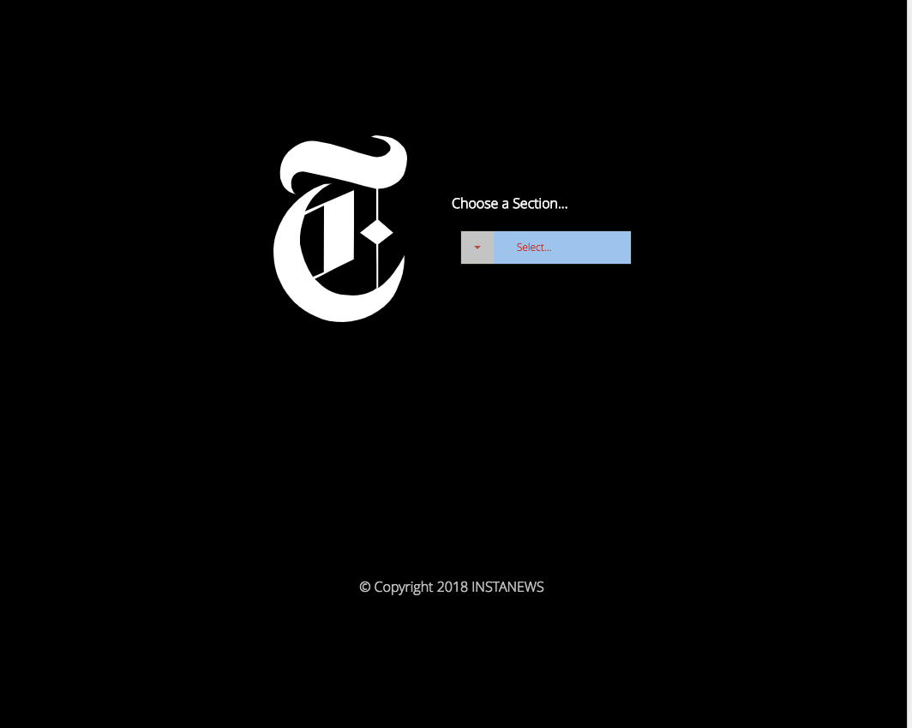
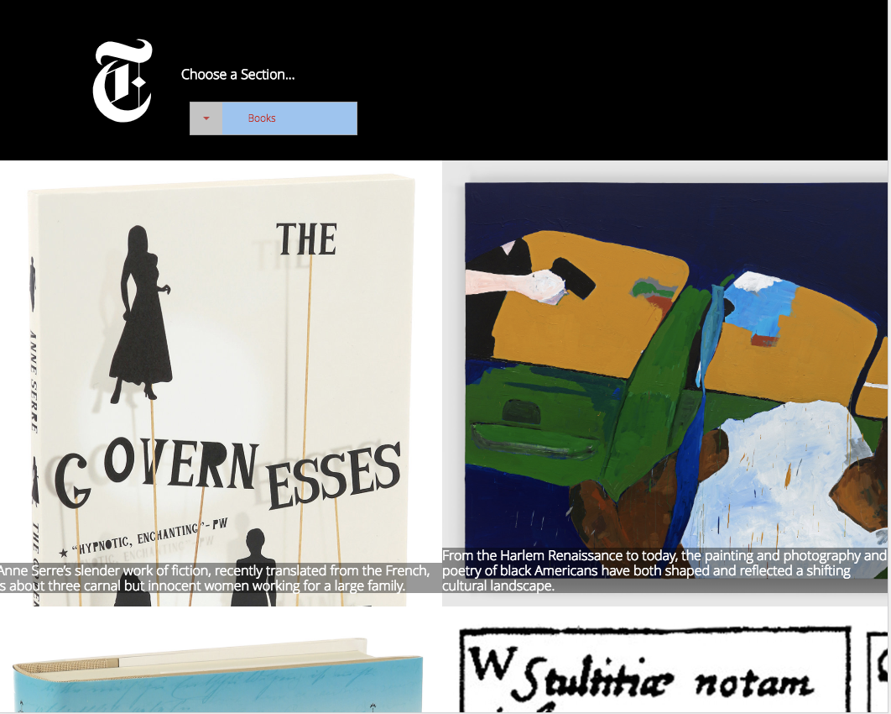
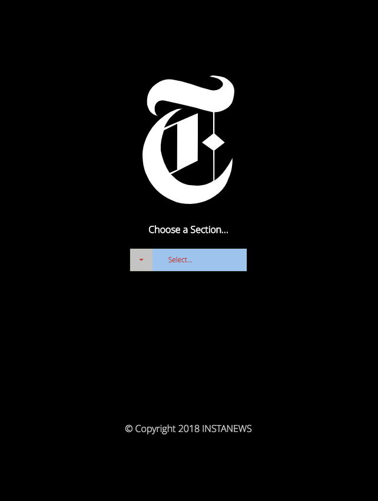
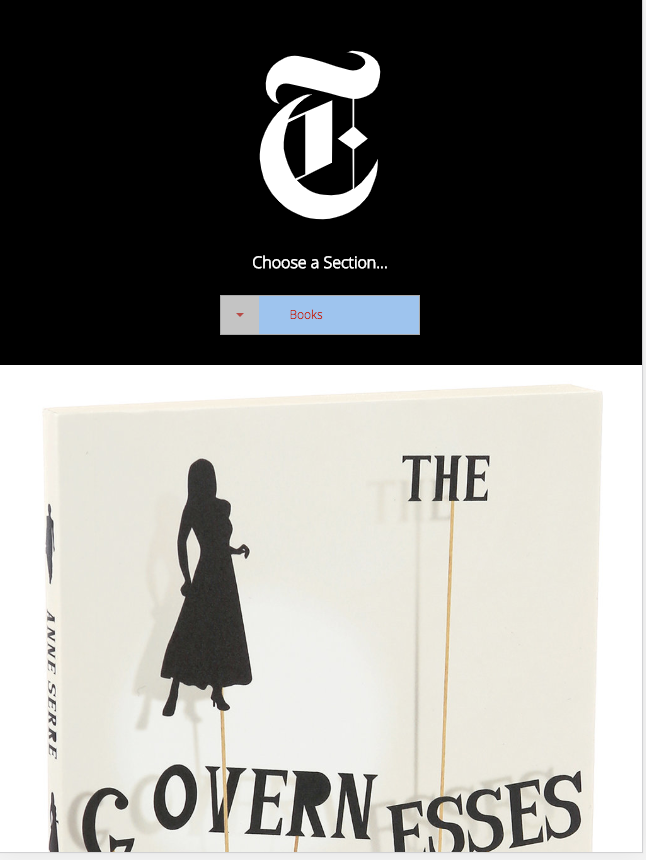

# Instanews README

**Version 1.0.0**

This website grabs new stories from the New York Times and displays them based on which category is selected. The site is also fit for use on mobile, tablet, and desktop.

## Desktop

## Tablet

## Mobile

**Built With**

HTML - used as the framework of the website

JavaScript - used to get New York Times API and display its contents

New York Times API - used for content

CSS - used to style HTML

Transfonter - used for getting fonts used on this website

**Author**

- Kyle Tecson

**Things I Learned**

How to use APIs to get data from servers. How to use ajax in JavaScript. How to separate my styles into different parcels using scss. How to install and use gulp and browser sync.
